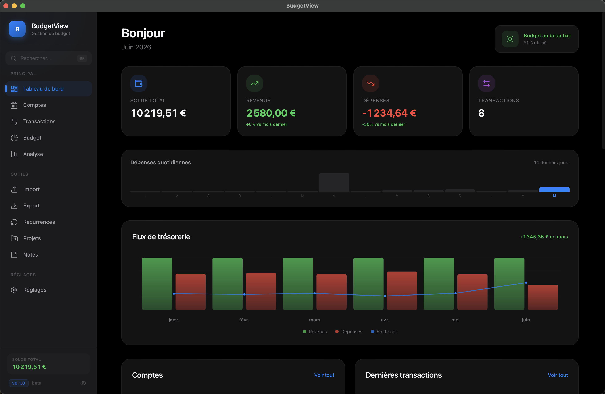

<div align="center">

# 💰 BudgetView

**Gérez votre budget personnel, gratuitement, en toute confidentialité.**

Application de gestion de budget moderne, open source et 100 % hors-ligne.
Vos données financières restent sur votre machine — point final.

[](LICENSE)
[](https://tauri.app)
[](https://svelte.dev)
[](https://github.com/UnixSafe/budgetview-tauri/releases)
[]()



</div>

---

## 🕊️ L'histoire

**BudgetView** était un logiciel français de gestion de budget personnel, vendu pendant
des années sur [budgetview.fr](https://budgetview.fr). Lorsque son éditeur a mis fin à
l'aventure commerciale, il a eu l'élégance de **libérer le logiciel** pour que ses
utilisateurs ne soient pas abandonnés et que le projet puisse continuer à vivre.

Ce dépôt est une **réécriture moderne et complète** de ce logiciel : même philosophie
(votre budget vous appartient, vos données aussi), mais avec une stack d'aujourd'hui —
légère, rapide et multiplateforme. Aucune ligne de l'ancien code Java n'a été reprise :
c'est une nouvelle implémentation, fidèle à l'esprit de l'originale.

> ⚠️ **Statut : alpha.** Le cœur fonctionne (comptes, import bancaire, catégorisation,
> budget, analyse), mais attendez-vous à des bugs et des changements. Les retours,
> issues et contributions sont très bienvenus — c'est tout l'intérêt de l'open source.

## ✨ Fonctionnalités

### Comptes & transactions
- 🏦 Multi-comptes : courant, épargne, carte de crédit, espèces
- 📥 **Import bancaire OFX, QIF et CSV** (formats des banques françaises), avec
  détection automatique du format, aperçu, déduplication et annulation d'import
- ✂️ Ventilation d'une transaction entre plusieurs catégories
- ✔️ Pointage / rapprochement bancaire
- ⇄ **Décalage de mois budgétaire** : comptez une opération dans le budget d'un autre
  mois que celui de sa date bancaire (le salaire du 30 mai compte pour juin)
- 🔍 Recherche globale (⌘K), filtres, sélection par lot

### Budget & catégorisation
- 🗂️ Catégories par domaine : revenus, charges fixes, variables, extras, épargne, virements
- 🤖 **Auto-catégorisation à 3 niveaux** : règles apprises de vos choix, dictionnaire de
  plus de 1 000 mots-clés français, et option IA (OpenRouter / xAI, désactivée par défaut)
- 🎯 Budget mensuel par catégorie, comparaison prévu / réalisé, report de budget
- 🔁 Détection automatique des opérations récurrentes et alertes sur les échéances manquées

### Analyse & pilotage
- 📊 Tableau de bord : solde, flux de trésorerie, dépenses quotidiennes, alertes budget
- 📈 Graphiques annuels, répartition par catégorie, top dépenses, comparaison N-1
- 🔮 Trésorerie prévisionnelle sur 6 mois
- 🎯 Projets d'épargne et objectifs

### Confidentialité & confort
- 🔒 **100 % hors-ligne** : aucune donnée n'est envoyée nulle part, tout est dans une
  base SQLite locale
- 🙈 Mode confidentiel (masquage des montants), verrouillage par mot de passe
- 💾 Sauvegarde / restauration de la base en un clic
- 🌙 Interface sombre soignée, raccourcis clavier, undo

## 📦 Installation

Téléchargez la dernière version pour votre système sur la page
**[Releases](https://github.com/UnixSafe/budgetview-tauri/releases)** :
macOS (Apple Silicon & Intel), Windows et Linux (x64 & ARM64).

> **macOS** : l'application n'est pas encore signée/notariée (certificat Apple payant).
> Au premier lancement : clic droit sur l'app → **Ouvrir**, ou bien
> `xattr -cr /Applications/BudgetView.app` dans le terminal.

## 🛠️ Compiler depuis les sources

Prérequis : [Node.js](https://nodejs.org) ≥ 20, [Rust](https://rustup.rs) stable, et les
[dépendances Tauri](https://tauri.app/start/prerequisites/) de votre plateforme.

```sh
git clone https://github.com/UnixSafe/budgetview-tauri.git
cd budgetview-tauri
npm install

# Développement (hot reload)
npx tauri dev

# Build de production (binaire + installeur)
npx tauri build
```

Lancer les tests :

```sh
npx vitest run                                  # tests frontend
cargo test --manifest-path src-tauri/Cargo.toml # tests backend
```

## 🧱 Stack technique

| Couche | Technologie |
|---|---|
| Interface | [Svelte 5](https://svelte.dev) (runes) + [SvelteKit](https://svelte.dev/docs/kit) + [TailwindCSS 4](https://tailwindcss.com) |
| Application | [Tauri 2](https://tauri.app) (Rust) — binaires légers, natifs, multiplateformes |
| Données | SQLite local (montants stockés en centimes — jamais de flottants pour l'argent) |
| Graphiques | Chart.js |

## 🤝 Contribuer

Le projet est jeune et **toute aide est précieuse** :

- 🐛 Un bug ? [Ouvrez une issue](https://github.com/UnixSafe/budgetview-tauri/issues)
  avec les étapes pour le reproduire.
- 💡 Une idée ? Discutons-en dans les issues avant de coder.
- 🔧 Une PR ? Avec plaisir — merci de faire passer `cargo test` et `npx vitest run`
  avant de soumettre, et d'ajouter des tests pour tout nouveau comportement.
- 🌍 L'interface est en français ; l'internationalisation est une contribution rêvée.

## 🗺️ Feuille de route

- [ ] Profils de récurrence avancés pour les budgets (bimestriel, saisonnier…)
- [ ] Export PDF et OFX
- [ ] Internationalisation (i18n)
- [ ] Chiffrement de la base de données
- [ ] Signature/notarisation des binaires macOS et Windows
- [ ] Synchronisation optionnelle entre appareils (chiffrée de bout en bout)

## 📜 Licence

Distribué sous licence **[GPL-3.0](LICENSE)** : vous pouvez utiliser, étudier, modifier
et redistribuer ce logiciel librement, à condition que vos versions modifiées restent
sous la même licence. Votre budget restera libre. 🕊️

*Hommage au BudgetView original et à son éditeur, qui a choisi de libérer son travail
plutôt que de le laisser disparaître.*
